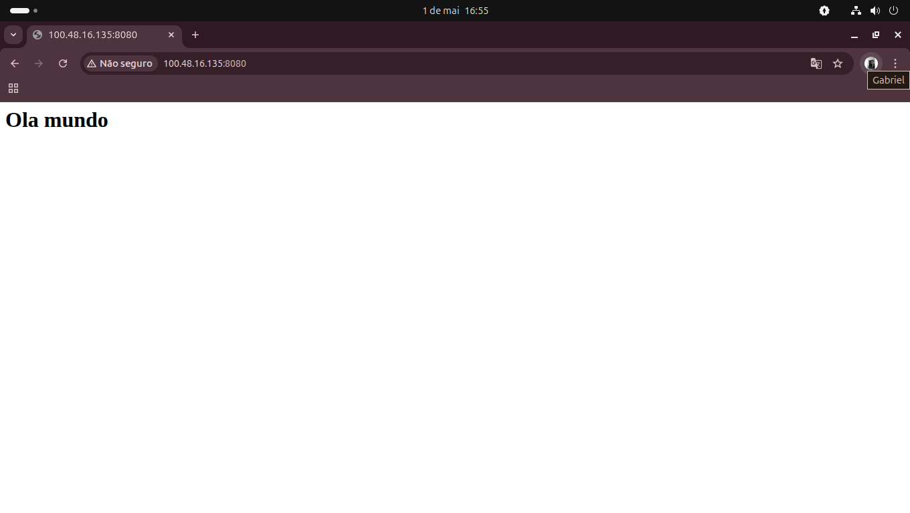

# Terraform EC2 na AWS

Provisionamento de uma instância EC2 na AWS usando Terraform, como parte dos meus estudos práticos de DevOps.

## O que esse projeto faz

- Busca automaticamente a AMI mais recente do Ubuntu 24.04
- Sobe uma instância EC2 (t3.micro) na região us-east-1
- Associa um Key Pair para acesso SSH

## Tecnologias usadas

- Terraform 1.2+
- AWS EC2
- Ubuntu 24.04 LTS

## Como usar

**Pré-requisitos:**
- AWS CLI configurado (`aws configure`)
- Terraform instalado
- Um Key Pair criado na AWS

**Subir a infraestrutura:**
```bash
terraform init
terraform apply
```

**Destruir a infraestrutura:**
```bash
terraform destroy
```

## Aprendizados

- Infraestrutura como código na prática
- Configuração de provider AWS no Terraform
- Uso de data source para buscar AMIs dinamicamente
- Gerenciamento de Key Pairs na AWS
- Conexão SSH em instâncias EC2

## Demonstração

Servidor web rodando na instância EC2 provisionada pelo Terraform:



## Testando você mesmo

1. Clone o repositório
2. Configure suas credenciais AWS (`aws configure`)
3. Crie um Key Pair na AWS e anote o nome
4. No `main.tf`, altere `key_name` para o nome do seu Key Pair
5. Rode `terraform init` e `terraform apply`
6. Conecte via SSH:

```bash
ssh -i "sua-chave.pem" ubuntu@<IP_PUBLICO>
```
